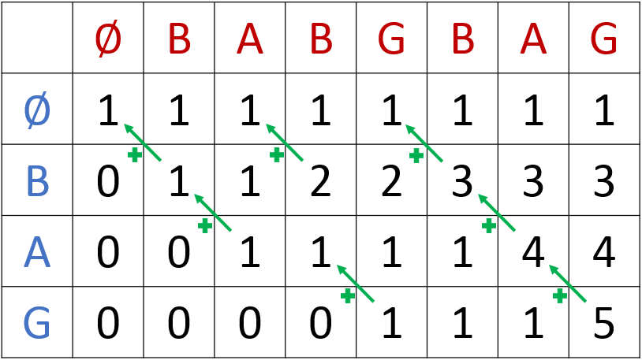

# Sub-sequence counting

<link rel="stylesheet" href="https://cdnjs.cloudflare.com/ajax/libs/KaTeX/0.5.1/katex.min.css">
<script src="https://cdn.mathjax.org/mathjax/latest/MathJax.js?config=TeX-AMS-MML_HTMLorMML" type="text/javascript"></script>

The problem proposed here is from an old ACM programming competition (UVA
10069). It is meant as a learning tool to study dynamic programming.

> A subsequence of a given sequence $S$ consists of $S$ with zero or more elements
> deleted. Formally a sequence $Z=z_1 z_2...z_k$ is a subsequence of $X=x_1 x_2...x_m$ if
> there exists a strictly increasing sequence $<i_1,i_2,...,i_k>$ of indices of $X$
> such that for all $j=1,2,...,k$ we have $x_{i_j}=z_j$. The problem is to write a
> program that counts the number of occurrences of $Z$ in $X$ as a subsequence such
> that each has a distinct index sequence.

For example, the word `bag` can appear as a subsequence of `babgbag` in five
different ways, as illustrated below. 

```text
babgbag
-------
ba g
ba    g
b    ag
  b  ag
    bag
```

## Simplification

Observe that if the symbols from the sequence $X$ which do not occur in the
sequence $Z$ are removed from $X$ to form a new sequence $X'$ the count will
remain the same. For example if $X$ is `ABCDEAEDCBA` and we are looking for
sub-sequences that match `ABA`, we can filter $X$ for just those the symbols
`A` and `B` leaving $X'$ `ABABA`. Preprocessing $X$ to remove unused symbols
can improve performance (when searching for a matching symbol) without
affecting the result.

## Recursion

We are being asked to count how many sequences $<i_1,i_2,...,i_k>$ of indices
of $X$ match the constraints:

* the $i_j$ are strictly increasing, and
* for all $j=1,2,...,k$ we have $x_{i_j}=z_j$.

Let's call this count $C(Z,X)$ and define $C(\emptyset,X)=1$ for all $X$.

We will use the notation $Z_j=z_1 z_2...z_j$ for $j<=k$ and likewise for
$X_i=x_1 x_2...x_i$ for $i<=m$ to represent the possible initial sequences of
$X$ and $Z$ respectively. We define $X_0=Z_0=\emptyset$, the empty sequence.
With this notation we can write $C(Z,X)=C(Z_k, X_m)$ assuming $k=|Z|, m=|X|$.

We see that our counting problem can be solved by recursion by observing that
if $x_{i_k}=z_k$, then the number of sequences of indices ending in $i_k$ is
equal to $C(Z_{k-1},X_{i_k-1})$. For example, the number of ways in which the
last `g` in `bag` (index $z_3$) can match the last `g` in `babgbag` (index
$x_7$) is precisely the number of ways in which `ba` can be embedded as a
subsequence of `babgba`. We simply lop off the matching letters and all that
follows. This is a simpler sub-problem of the original problem.

Of course the last `g` in `bag` (index $z_3$) doesn't have to match the last
`g` in `babgbag`; it can also match the second last `g` (index $x_4$). The
number of ways in which $i_k$ can be chosen so that $x_{i_k}=z_k$ is precisely
the number of occurrences of the symbol $z_k$ in $X$. Thus the solution is
expressed in the recurrence:

$$C(Z_k,X_m) = \sum_{i_k \in\{i_k | x_{i_k}=z_k\}} C(Z_{k-1},X_{i_k-1})$$

The number of matches $x_{i_k}=z_k$ may be zero in which case the sum is zero.
The recurrence also ends if $k=0$ since $Z_0=\emptyset$ so $C(Z_k,X_m) = 1$.

Using our example from above where Z=`bag` and X=`babgbag` we can work out a
tree of recurrences. The notation `C(bag,babgbag)` signifies the number of ways
in which the string `bag` can be embedded in `babgbag` as a subsequence.
Expanding this expression is done by matching the last letter in the first
argument with the occurrences of that letter in the right, dropping the
matching letters and all following letters. The nodes `C(∅,...)` are leaf nodes
and so are not expanded.

```text
C(bag,babgbag)  = C(ba,babgba) + C(ba,bab)
C(ba,babgba)    = C(b,babgb) + C(b,b)
C(b, babgb)     = C(∅,babg) + C(∅,ba) + C(∅,∅)
C(b,b)          = C(∅,∅)
C(ba,bab)       = C(b,b)
C(b,b)          = C(∅,∅)
```

Substituting values computed at the leaf nodes of the tree (all 1) up the
recursion stack we arrive at the final answer.

```text
C(bag,babgbag)  = C(ba,babgba) + C(ba,bab)      = 5
C(ba,babgba)    = C(b,babgb) + C(b,b)           = 4
C(b,babgb)      = C(∅,babg) + C(∅,ba) + C(∅,∅)  = 3
C(b,b)          = C(∅,∅)                        = 1
C(ba,bab)       = C(b,b)                        = 1
C(b,b)          = C(∅,∅)                        = 1
```

Note that the top down approach would work just as well if we searched for the
first symbol of $Z$ in $X$ rather than the last.

## Memoization

The implementation of this recursive solution can sometimes be made more
efficient by memoization since the counts $C(Z_k,X_m)$ may occur in multiple
recurrences. In our example, the value `C(b,b)` was computed twice. In certain
problems the repeated calculations would dominate the performance. The worst
case depends on the number of branches in the tree being built - potentially
exponential.

The number of cache entries for the subsequence counting problem will be at
most O($|Z||X|$). It should be much less in practice since only indexes of $X$
prior to a matching letter will be referenced. The more entries are reused the
more memoization can improve the performance.

Memoization using a hash table does come at a cost. The hash value for the key
has to be computed and looked up in the table for each call. For every cache
miss, memory has to be allocated to store the key and result values. And the
memoized approach is still recursive, incurring the cost of a function call. If
the branch factor is insufficient memoization will perform worse than simple
recursion.

## Dynamic Programming

Fortunately this problem has the *optimal sub-problem* property. This allows us
to use dynamic programming to build the solution from the bottom up. We do this
by iterating on the indexes in $Z$ and matching them against the indexes in
$X$.

To store the partial counts we create a $k+1$ by $m+1$ table. Entry $(i,j)$ is
equal to $C(Z_i,X_j)$. All entries in the first row, corresponding to
`C(∅,...)`, are initialized to 1. The remaining entries in the first column,
corresponding to `C(...,∅)`, are initialized to 0. All other entries get the
value to their left, unless the symbols match, in which case they get the sum
of the value on the left and the value in the cell north-east of the entry.



The relationship is expressed in this formula:

$$
T[i,j] = \begin{cases}
   T[i-1,j] &\text{if } Z[i] \ne X[j] \\
   T[i-1,j] + T[i-1,j-1] &\text{if } Z[i] = X[j]
\end{cases}
$$

The table can be filled in either by row or by column. An interesting
observation is that only two rows (or two columns) need to be kept in memory
since $T[i,j]$ depends only on values in the current row ($j$), the previous
row ($j-1$), and the previous column ($i-1$).

In fact, only one column is needed if the evaluations are done from high to low
index. Since for any non-trivial problem $|Z|\leq|X|$, storing a single column
leads to a very elegant solution with O($|Z|$) storage overhead. This is much
better than the memoized solution.

## Test Results

In order to test the performance of the different approaches we wrote four
solutions to the subsequence counting problem in [go](golang.org). These can be
found on github.

* a simple recursion based on $C(Z_k,X_m) = \sum_{i_k \in\{i_k | x_{i_k}=z_k\}} C(Z_{k-1},X_{i_k-1})$
* a similar self-referential recursion but with the sub-function passed in as a parameter
* a memoized solution that used the second function
* a dynamic programming implementation based on a single column tableau

All the algorithms produced correct results on all problems. Here are the
problems used in the benchmark and their solutions.

| Name | Z        | X                | C(Z,X)   |
|------|----------|------------------|----------|
|small | bag      | babgbag          | 5        |
|med-1 | bag      | babgbagbabgbag   | 27       |
|med-2 | baag     | babgbagbabgbag   | 19       |
|med-3 | tag      | taggcttgaagaaagg | 42       |
|big-1 | aaaaaaaa | aaaaaaaaaaaaaaaa | 12870    |

The benchmarks from these implementations (the self referential recursion
results are similar to recursion and so are not shown) over all problems show
that the dynamic programming solution runs consistently faster than the
memoized solution by a factor of 17 to 200. Surprisingly, the memoized solution
was far worse than simple recursion in all but the biggest problem.

The test results from one run are below but can be verified independently by
cloning the repository and running the benchmark. The first column is the name
of the test, which includes the name of the algorithm (`Dynamic`, `Memoized`,
`Recursive`) and the name of the problem (e.g. `small`) concatenated. The
second column shows the number of repetitions of the test that were run. This
number was chosen during the testing. The third column shows the average
running time of each top level call. The last two columns show memory used and
number of allocations done, per call.

```text
Running tool: C:\Go\bin\go.exe test -benchmem -run=^$ . -bench ^Benchmark$

Benchmark/Dynamic-small-8         	10000000	       135 ns/op	      32 B/op	       1 allocs/op
Benchmark/Recursive-small-8       	10000000	       170 ns/op	       0 B/op	       0 allocs/op
Benchmark/Memoized-small-8        	  500000	      2290 ns/op	     440 B/op	       4 allocs/op

Benchmark/Dynamic-med-1-8         	10000000	       197 ns/op	      32 B/op	       1 allocs/op
Benchmark/Recursive-med-1-8       	 3000000	       516 ns/op	       0 B/op	       0 allocs/op
Benchmark/Memoized-med-1-8        	  200000	      8415 ns/op	    2652 B/op	       6 allocs/op

Benchmark/Dynamic-med-2-8         	10000000	       225 ns/op	      48 B/op	       1 allocs/op
Benchmark/Recursive-med-2-8       	 2000000	       619 ns/op	       0 B/op	       0 allocs/op
Benchmark/Memoized-med-2-8        	  200000	      9050 ns/op	    2662 B/op	       6 allocs/op

Benchmark/Dynamic-med-3-8         	10000000	       213 ns/op	      32 B/op	       1 allocs/op
Benchmark/Recursive-med-3-8       	 2000000	       623 ns/op	       0 B/op	       0 allocs/op
Benchmark/Memoized-med-3-8        	  200000	      9310 ns/op	    2656 B/op	       6 allocs/op

Benchmark/Dynamic-big-1-8         	 3000000	       480 ns/op	      80 B/op	       1 allocs/op
Benchmark/Recursive-big-1-8       	    5000	    321218 ns/op	       0 B/op	       0 allocs/op
Benchmark/Memoized-big-1-8        	   20000	     91505 ns/op	   12662 B/op	      12 allocs/op

ok  	subsequence	40.437s
Success: Benchmarks passed.
```

This concludes our investigation of dynamic programming on the subsequence counting problem. The
lessons learned here can inform decisions made when considering the tradeoffs of memoization and
dynamic programming in other problem areas.
